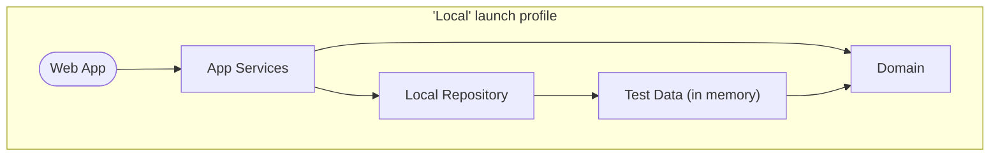
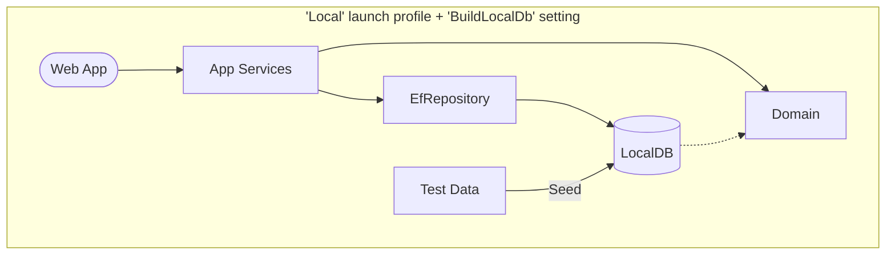
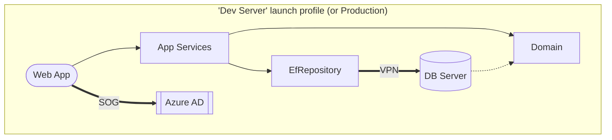

# Complaint Tracking System Application

The Complaint Tracking System (CTS) is an online application to allow EPD staff to enter, assign, review, and close complaints received from the public.

---

## Background and project requirements

Public complaints are time-critical and high-profile public information. The CTS is used by staff throughout EPD.

* The application will allow EPD staff to enter new complaints, review and update existing complaints, and remove complaints erroneously entered.
* The admin side of the application will be restricted to authenticated EPD employees.
* A public web site will be available for reviewing or searching for complaints.

## Info for developers

This is an ASP.NET 6 web application.

### Prerequisites for development

+ [Visual Studio](https://www.visualstudio.com/vs/) or similar
+ [.NET 6.0 SDK](https://dotnet.microsoft.com/download)

### Project organization

The solution contains the following projects:

* **Domain** — A class library containing the data models and business logic.
* **AppServices** — A class library containing the services used by an application to interact with the domain.
* **LocalRepository** — A class library implementing the repository and services without using a database (for local development).
* **EfRepository** — A class library implementing the repository and services using LocalDb and Entity Framework.
* **WebApp** — The front end web application.

There are also corresponding unit test projects for each, plus a **TestData** project containing test data for development and testing.

### Launch profiles

There are two launch profiles:

* **WebApp Local** — This profile uses data in the "TestData" project and does not connect to any external server. A local user account is used to simulate authentication.

    You can modify some development settings by creating an "appsettings.Local.json" file in the "WebApp" folder to test various scenarios:

    - *AuthenticatedUser* — Simulates a successful login with a test account when `true`. Simulates a failed login when `false`.
    - *AuthenticatedUserIsAdmin* — Applies all App Roles to the logged in account when `true` or no roles when `false`. (Only applies if *AuthenticatedUser* is `true`.)
    - *BuildLocalDb* — Uses LocalDB when `true`. Uses in-memory data when `false`.
    - *UseEfMigrations* - Uses Entity Framework migrations when `true`. Deletes and recreates database when `false`. (Only applies if *BuildLocalDb* is `true`.)

* **WebApp Dev Server** — This profile connects to a remote database server for data and requires an SOG account to log in. *To use this profile, you must add the "appsettings.Development.json" file from the "app-config" repo.*

    Most development should be done using the Local profile. The Dev Server profile is only needed when specifically troubleshooting issues with the database server or SOG account.

Here's a visualization of how each launch profile (plus the `BuildLocalDb` setting) configures the application at runtime.

