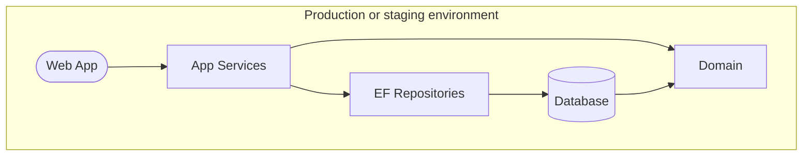

# Complaint Tracking System Application

The Complaint Tracking System (CTS) is an online application to allow EPD staff to enter, assign, review, and close complaints received from the public.


[](https://github.com/gaepdit)
[](https://github.com/gaepdit/complaint-tracking/actions/workflows/dotnet-test.yml)
[](https://sonarcloud.io/summary/new_code?id=gaepdit.complaint-tracking)
[](https://sonarcloud.io/summary/new_code?id=gaepdit.complaint-tracking)

---

## Background and project requirements

Public complaints are time-critical and high-profile public information. The CTS is used by staff throughout EPD.

* The application will allow EPD staff to enter new complaints, review and update existing complaints, and remove complaints erroneously entered.
* The admin side of the application will be restricted to authenticated EPD employees.
* A public website will be available for reviewing or searching for complaints.

## Info for developers

This is an ASP.NET web application.

### Prerequisites for development

+ [Visual Studio](https://www.visualstudio.com/vs/) or similar
+ [.NET SDK](https://dotnet.microsoft.com/download)

### Project organization

The solution contains the following projects:

* **Domain** — A class library containing the data models, business logic, and repository interfaces.
* **AppServices** — A class library containing the services used by an application to interact with the domain.
* **LocalRepository** — A class library implementing the repositories and data stores using static in-memory test data (for local development).
* **EfRepository** — A class library implementing the repositories and data stores using Entity Framework and a database (as specified by the configured connection string).
* **WebApp** — The front end web application and/or API.
* **TestData** — A class library containing test data for development and testing.

There are also corresponding unit test projects for each (not counting the `TestData` project).

### Development settings

The following settings section configures the data stores, authentication, and other settings for development purposes. To work with these settings, add an `appsettings.Development.json` file in the root of the `WebApp` folder with a `DevSettings` section, and make your changes there. Here's a sample `appsettings.Development.json` file to start out:

```json
{
  "DevSettings": {
    "UseDevSettings": true,
    "UseInMemoryData": true,
    "UseEfMigrations": false,
    "DeleteAndRebuildDatabase": true,
    "UseAzureAd": false,
    "LocalUserIsAuthenticated": true,
    "LocalUserRoles": [],
    "UseSecurityHeadersInDev": false,
    "EnableWebOptimizer": false
  }
}
```

- *UseDevSettings* — Indicates whether the following Dev settings should be applied.
- *UseInMemoryData*
  - When `true`, the `LocalRepository` project is used for repositories and data stores. Data is initially seeded from the `TestData` project.
  - When `false`, the `EfRepository` project is used, and a SQL Server database (as specified by the connection string) is created. (If the connection string is missing, then a temporary EF Core in-memory database provider is used. This option is included for convenience and is not recommended.)
- *UseEfMigrations* — Uses Entity Framework database migrations when `true`. When `false`, the `DeleteAndRebuildDatabase` setting controls how the database is handled. (Only applies if `UseInMemoryData` is `false`.)
- *DeleteAndRebuildDatabase* — When set to `true`, the database is deleted and recreated on each run. When set to `false`, the database is not modified on each run. (Only applies if `UseInMemoryData` and `UseEfMigrations` are both `false`.) If the database does not exist yet, it will not be created if this is set to `false`. The database is seeded with data from the `TestData` project only when `UseEfMigrations` is `false` and `DeleteAndRebuildDatabase` is `true`. Otherwise, the data in the database is not changed.
- *UseAzureAd* — If `true`, connects to Azure AD for user authentication. (The app must be registered in the Azure portal, and configuration added to the settings file.) If `false`, authentication is simulated using test user data.
- *LocalUserIsAuthenticated* — Simulates a successful login with a test account when `true`. Simulates a failed login when `false`. (Only applies if `UseAzureAd` is `false`.)
- *LocalUserRoles* — Adds the listed App Roles to the logged in account. (Only applies if `LocalUserIsAuthenticated` is `true`.)
- *UseSecurityHeadersLocally* — Sets whether to include HTTP security headers when running locally in the Development environment.
- *EnableWebOptimizer* — Enables the WebOptimizer middleware for bundling and minification of CSS and JavaScript files. (This is disabled by default to simplify debugging.)

#### Seeding user roles

There are two ways to seed user roles, depending on the authentication method chosen.

When authenticating as a test user (`UseAzureAd` set to `false`), the `LocalUserRoles` setting determines the roles assigned to the user. Add the desired roles to the array using their short name. For example:

```json
{
  "LocalUserRoles": ["Staff", "SiteMaintenance"]
}
```

When authenticating using AzureAD (`UseAzureAd` set to `true`), roles can be seeded using the `SeedUserRoles` setting. This setting is also used in production if needed to help seed initial admin roles. The roles are added to the user's account the first time they log in. For example:

```json
{
  "SeedUserRoles": [
    {
      "User": "user1@example.com",
      "Roles": ["UserAdmin", "Staff"]
    }
  ]
}
```

#### Production defaults

In a production or staging environment (or if `UseDevSettings` is set to `false` or the `DevSettings` section is missing), the settings are automatically set to production defaults as follows:

```csharp
UseDevSettings = false,
UseInMemoryData = false,
UseEfMigrations = true,
DeleteAndRebuildDatabase = false,
UseAzureAd = true,
EnableWebOptimizer = true,
```

#### Data persistence

Here's a visualization of how the settings configure data storage at runtime.



