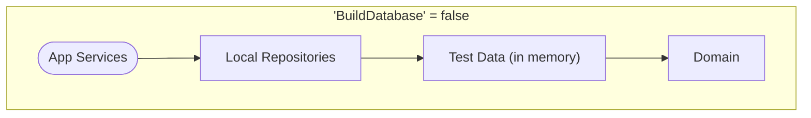
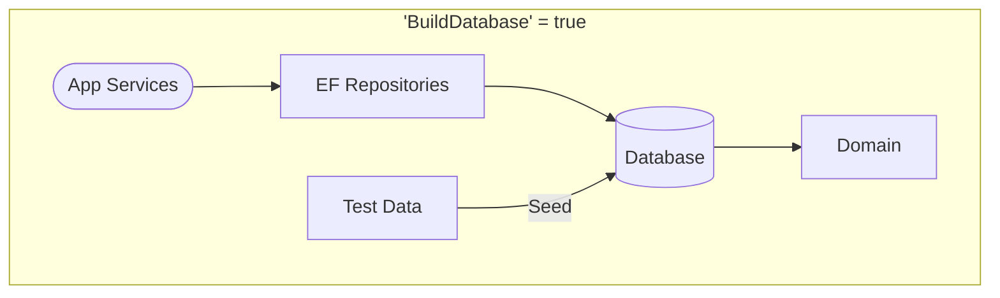
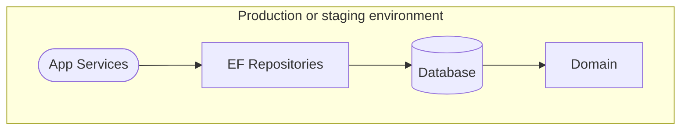

# Complaint Tracking System Application

The Complaint Tracking System (CTS) is an online application to allow EPD staff to enter, assign, review, and close
complaints received from the public.

[](https://github.com/gaepdit)
[](https://github.com/gaepdit/complaint-tracking/actions/workflows/dotnet-test.yml)
[](https://sonarcloud.io/summary/new_code?id=gaepdit.complaint-tracking)
[](https://sonarcloud.io/summary/new_code?id=gaepdit.complaint-tracking)

## Background and project requirements

Public complaints are time-critical and high-profile public information. The CTS is used by staff throughout EPD.

* The application will allow EPD staff to enter new complaints, review and update existing complaints, and remove
  complaints erroneously entered.
* The admin side of the application will be restricted to authenticated EPD employees.
* A public website will be available for reviewing or searching for complaints.

## Solution organization

The solution contains the following projects:

* **Domain** — A class library containing the data models, business logic, and repository interfaces.
* **AppServices** — A class library containing the services used by an application to interact with the domain.
* **LocalRepository** — A class library implementing the repositories and data stores using static in-memory test data
  (for local development).
* **EfRepository** — A class library implementing the repositories and data stores using Entity Framework and a
  database (as specified by the configured connection string).
* **WebApp** — The front end web application and API.
* **TestData** — A class library containing test data for development and testing.

There are also corresponding unit test projects for each (not counting the `TestData` project).

## Development settings

The following settings section configures the data stores, authentication, and other settings for development purposes.
To work with these settings, add an `appsettings.Development.json` file in the root of the `WebApp` folder with a
`DevSettings` section, and make your changes there. Here's a sample `appsettings.Development.json` file to start out:

```json
{
  "DevSettings": {
    "UseDevSettings": true,
    "BuildDatabase": false,
    "UseEfMigrations": false,
    "EnableTestUser": true,
    "LocalUserIsAuthenticated": true,
    "TestUserRoles": [
      "Staff",
      "SiteMaintenance"
    ],
    "UseSecurityHeadersInDev": false,
    "EnableWebOptimizerInDev": false
  }
}
```

- *UseDevSettings* — Indicates whether the following Dev settings should be applied.

### Dev database settings

- *BuildDatabase*
    - When `true`, the `EfRepository` project is used. A SQL Server database is created, and data is seeded from the
      `TestData` project.
    - When `false`, the `LocalRepository` project is used. In-memory data is initialized from the `TestData` project.
- *UseEfMigrations* — Applies Entity Framework database migrations when `true`. When `false`, the database is created
  directly based on the `DbContext`. (Only applies if `BuildDatabase` is `true`.)

### Dev authentication settings

- *EnableTestUser* — If `true`, a test user account will be available for development purposes.
- *TestUserIsAuthenticated* — Simulates a successful login with a test account when `true`. Simulates a failed login
  when `false`. (Only applies if `EnableTestUser` is `false`.)
- *TestUserRoles* — Adds the listed App Roles to the logged-in account. (Only applies if `TestUserIsAuthenticated` is
  `true`.)

### Miscellaneous dev settings

- *UseSecurityHeadersInDev* — Sets whether to include HTTP security headers when running in the Development environment.
- *EnableWebOptimizerInDev* — Sets whether to enable the WebOptimizer middleware for bundling and minification of CSS
  and JavaScript files when running in the Development environment.

## Production settings

In a production or staging environment, `UseDevSettings` is automatically set to `false` regardless of what is specified
in the `appsettings.json` file.

### Database settings

Connection Strings for both a `DefaultConnection` and a `MigrationConnection` must be specified.

- The `DefaultConnection` is used for normal app connectivity. The account only requires DML rights on the database.
- The `MigrationConnection` is only used for applying Entity Framework migrations. The account requires DDL plus select
  and insert rights on the database.

### Authentication settings

The login providers must be enabled and configured. Currently, Okta and (Azure) Entra ID are available in the application. 

1. To enable authentication using Entra ID, the app must be registered in the Azure portal and configured in the `AzureAd` settings section.

  ```json
  {
    "AzureAd": {
      "Instance": "https://login.microsoftonline.com/",
      "CallbackPath": "/signin-oidc",
      "TenantId": "[Enter the Directory (tenant) ID from the Azure portal]",
      "ClientId": "[Enter the Application (client) ID from the Azure portal]"
    }
  }
  ```

2. To enable Okta, the app must be registered in the Okta portal and configured in the `Okta` settings section.

  ```json
  {
    "Okta": {
      "OktaDomain": "https://${yourOktaDomain}",
      "ClientId": "${clientId}",
      "ClientSecret": "${clientSecret}",
      "AuthorizationServerId": "default"
    }
  }
  ```

3. Finally, the login providers must be enabled in the `EnabledLoginProviders` section along with the allowed Okta organization ID or Entra Tenant ID. 

```json
{
  "EnabledLoginProviders": [
    {
      "Name": "EntraId",
      "Id": "tenant-1-id"
    },
    {
      "Name": "EntraId",
      "Id": "tenant-2-id"
    },
    {
      "Name": "Okta",
      "Id": "okta-id"
    }
  ]
}
```

### Seeding user roles

User roles can be seeded using the `SeedUserRoles` setting. The roles are added to the user's account the first time
they log in. For example:

```json
{
  "SeedUserRoles": [
    {
      "User": "user1@example.com",
      "Roles": [
        "UserAdmin",
        "Staff"
      ]
    }
  ]
}
```

## Data persistence

Here's a visualization of how the settings configure data storage at runtime.






