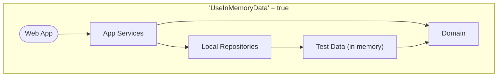
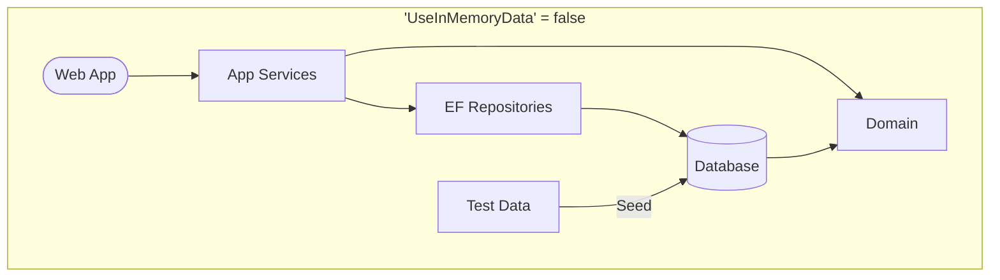
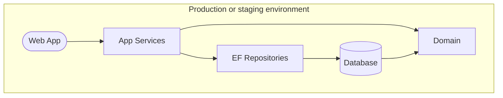

# Complaint Tracking System Application

The Complaint Tracking System (CTS) is an online application to allow EPD staff to enter, assign, review, and close
complaints received from the public.

[](https://github.com/gaepdit)
[](https://github.com/gaepdit/complaint-tracking/actions/workflows/dotnet-test.yml)
[](https://sonarcloud.io/summary/new_code?id=gaepdit.complaint-tracking)
[](https://sonarcloud.io/summary/new_code?id=gaepdit.complaint-tracking)

---

## Background and project requirements

Public complaints are time-critical and high-profile public information. The CTS is used by staff throughout EPD.

* The application will allow EPD staff to enter new complaints, review and update existing complaints, and remove
  complaints erroneously entered.
* The admin side of the application will be restricted to authenticated EPD employees.
* A public website will be available for reviewing or searching for complaints.

## Info for developers

This is an ASP.NET web application.

### Prerequisites for development

+ [Visual Studio](https://www.visualstudio.com/vs/) or similar
+ [.NET SDK](https://dotnet.microsoft.com/download)

### Project organization

The solution contains the following projects:

* **Domain** — A class library containing the data models, business logic, and repository interfaces.
* **AppServices** — A class library containing the services used by an application to interact with the domain.
* **LocalRepository** — A class library implementing the repositories and data stores using static in-memory test data
  (for local development).
* **EfRepository** — A class library implementing the repositories and data stores using Entity Framework and a
  database (as specified by the configured connection string).
* **WebApp** — The front end web application and/or API.
* **TestData** — A class library containing test data for development and testing.

There are also corresponding unit test projects for each (not counting the `TestData` project).

### Development settings

The following settings section configures the data stores, authentication, and other settings for development purposes.
To work with these settings, add an `appsettings.Development.json` file in the root of the `WebApp` folder with a
`DevSettings` section, and make your changes there. Here's a sample `appsettings.Development.json` file to start out:

```json
{
  "DevSettings": {
    "UseDevSettings": true,
    "BuildDatabase": false,
    "UseEfMigrations": false,
    "UseExternalAuthentication": false,
    "LocalUserIsAuthenticated": true,
    "LocalUserRoles": [
      "Staff",
      "SiteMaintenance"
    ],
    "UseSecurityHeadersInDev": false,
    "EnableWebOptimizerInDev": false
  }
}
```

- *UseDevSettings* — Indicates whether the following Dev settings should be applied.

#### Database settings

- *BuildDatabase*
  - When `true`, the `EfRepository` project is used. A SQL Server database is created, and data is seeded from the
    `TestData` project.
  - When `false`, the `LocalRepository` project is used. In-memory data is initialized from the `TestData` project.
- *UseEfMigrations* — Applies Entity Framework database migrations when `true`. When `false`, the database is created
  directly based on the `DbContext`. (Only applies if `BuildDatabase` is `true`.)

#### Authentication settings

- *UseExternalAuthentication* — If `true`, the app will use an external identity provider for authentication. If
  `false`, authentication is simulated using test user data.
    - To authenticate using Entra ID, the app must be registered in the Azure portal and configured in the `AzureAd`
      settings section.
    - To use Okta, the app must be registered in the Okta portal and configured in the `Okta` settings section.
- *LocalUserIsAuthenticated* — Simulates a successful login with a test account when `true`. Simulates a failed login
  when `false`. (Only applies if `UseExternalAuthentication` is `false`.)
- *LocalUserRoles* — Adds the listed App Roles to the logged-in account. (Only applies if `LocalUserIsAuthenticated` is
  `true`.)

#### Miscellaneous dev settings

- *UseSecurityHeadersInDev* — Sets whether to include HTTP security headers when running locally in the Development
  environment.
- *EnableWebOptimizerInDev* — Enables the WebOptimizer middleware for bundling and minification of CSS and JavaScript
  files. (This is disabled by default to simplify debugging.)

### Production settings

In a production or staging environment, `UseDevSettings` is automatically set to `false` regardless of what is specified
in the `appsettings.json` file.

#### Seeding user roles

User roles can be seeded using the `SeedUserRoles` setting. The roles are added to the user's account the first time
they log in. For example:

```json
{
  "SeedUserRoles": [
    {
      "User": "user1@example.com",
      "Roles": [
        "UserAdmin",
        "Staff"
      ]
    }
  ]
}
```

### Data persistence

Here's a visualization of how the settings configure data storage at runtime.


```mermaid
flowchart LR
    subgraph SPL["'UseInMemoryData' = true"]
        direction LR
        D[Domain]
        T["Test Data (in memory)"]
        R[Local Repositories]
        A[App Services]
        W([Web App])
        W --> A
        A --> D
        A --> R
        R --> T
        T --> D
    end
```


```mermaid
flowchart LR
    subgraph SPB["'UseInMemoryData' = false"]
        direction LR
        D[Domain]
        T[Test Data]
        R[EF Repositories]
        A[App Services]
        W([Web App])
        B[(Database)]
        W --> A
        A --> D
        R --> B
        A --> R
        T -->|Seed| B
        B --> D
    end
```


```mermaid
flowchart LR
    subgraph SPD["Production or staging environment"]
        direction LR
        D[Domain]
        R[EF Repositories]
        A[App Services]
        W([Web App])
        B[(Database)]
        W --> A
        A --> D
        A --> R
        R --> B
        B --> D
    end
```
