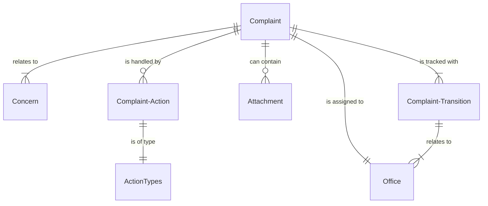

# Entity relationship diagram

Does not include user entities.

```mermaid
erDiagram

Complaint               ||--|{  Concern                 : "relates to"
Complaint               ||--o{  Complaint-Action        : "is handled by"
Complaint-Action        ||--||  ActionTypes             : "is of type"
Complaint               ||--o{  Attachment              : "can contain"
Complaint               ||--|{  Complaint-Transition    : "is tracked with"
Complaint               ||--||  Office                  : "is assigned to"
Complaint-Transition    ||--|{  Office                  : "relates to"
```
